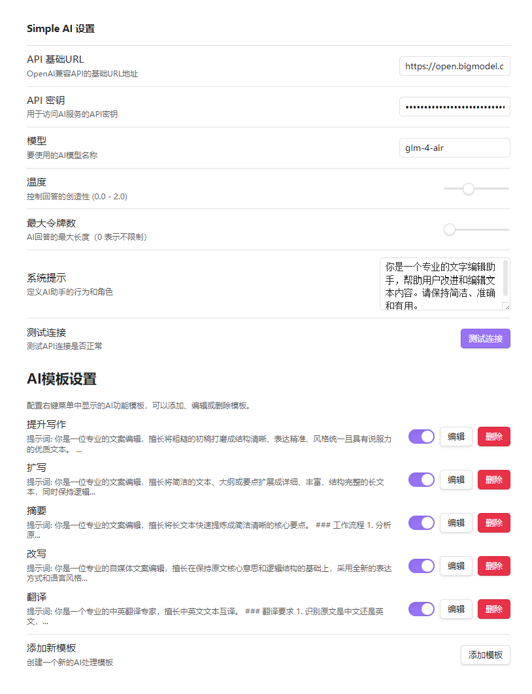
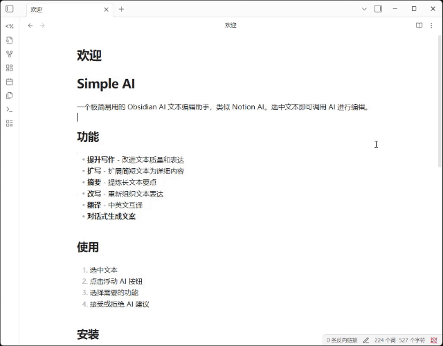
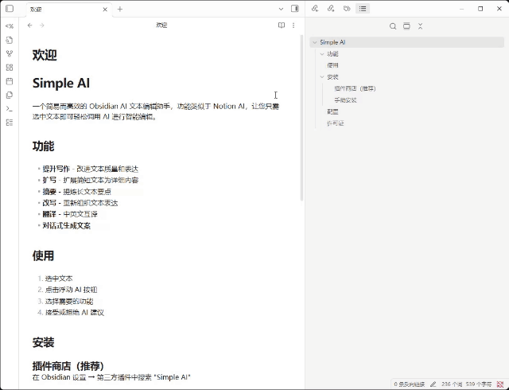

# Simple AI

一个极简易用的 Obsidian AI 文本编辑助手，类似 Notion AI。选中文本即可调用 AI 进行编辑。

## 使用

### 配置

只需要填写OpenAI兼容的BaseUrl、API密钥和一个常用模型即可。

### 划词助手
1. 选中文本
2. 点击浮动 AI 按钮
3. 选择需要的功能
4. 接受或拒绝 AI 建议

### 对话式AI
1. `Ctrl+P` 输入`simple ai`
2. 可选择多份文档加入上下文
3. 可在当前文档划词作为上下文
4. 就这么简单的开始了~

## 许可证

MIT License
